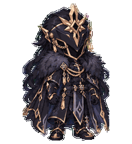

# Codex 桌面智能拍档

让六位熟悉的 Q 版角色，陪你一起写代码。

本仓库收录 **6 款日系 Q 版桌面拍档**，使用 `hatch-pet` 制作：**小神子、Miku、Raiden_Shogun、La Signora、Arlecchino、Il Capitano**。每款均包含真正透明的动画图集、**9 个标准动画状态**与 **16 个注视方向**，可安装到支持自定义 v2 拍档的 Codex 桌面应用中。

## 认识你的拍档

| 八重神子 · 小神子 | 初音未来 · Miku | 雷电将军 · Raiden_Shogun |
| :---: | :---: | :---: |
|  |  |  |
| 樱粉长发、狐耳与白红巫女服。温柔聪慧，带一点狡黠的笑意。 | 青绿色长双马尾与经典灰黑服装。安静乖巧，带一点天然呆。 | 深紫长辫、紫花金饰与和风服装。沉静端庄，动作温柔克制。 |
| [全部动画](Yae-Miko/previews/) · [角色说明](Yae-Miko/README.md) | [全部动画](Miku/previews/) · [角色说明](Miku/README.md) | [全部动画](Raiden-Shogun/previews/) · [角色说明](Raiden-Shogun/README.md) |

| 女士 · La Signora | 仆人 · Arlecchino | 队长 · Il Capitano |
| :---: | :---: | :---: |
|  |  |  |
| 浅金卷发、黑色半面面具、黑红礼服与白色毛领。优雅从容，带一点俏皮。 | 黑白层次发型、红色叉形瞳孔与黑白灰礼服。冷静利落，带着不张扬的温柔。 | 全覆式深色头盔、金色装饰、厚实毛领与披风。沉稳可靠，通过头盔和肢体传达情绪。 |
| [全部动画](La-Signora/previews/) · [角色说明](La-Signora/README.md) | [全部动画](Aarlecchino/previews/) · [角色说明](Aarlecchino/README.md) | [全部动画](Il-Capitano/previews/) · [角色说明](Il-Capitano/README.md) |

## 角色目录与下载

下表按当前文件名称列出。**文件夹名称、ZIP 名称和应用中的显示名称可能不同**，下载时请按对应关系选择。

| 角色 | 当前仓库文件夹 | 设置中的名称 | ZIP 素材包 |
| --- | --- | --- | --- |
| 八重神子 | [Yae-Miko](Yae-Miko/) | 小神子 | [Yae_Miko.zip](Yae_Miko.zip) |
| 初音未来 | [Miku](Miku/) | Miku | [miku.zip](miku.zip) |
| 雷电将军 | [Raiden-Shogun](Raiden-Shogun/) | Raiden_Shogun | [raiden-shogun.zip](raiden-shogun.zip) |
| 女士 | [La-Signora](La-Signora/) | La Signora | [la-signora.zip](la-signora.zip) |
| 仆人 | [Aarlecchino](Aarlecchino/) | Arlecchino | [arlecchino.zip](arlecchino.zip) |
| 队长 | [Il-Capitano](Il-Capitano/) | Il Capitano | [il-capitano.zip](il-capitano.zip) |

> 仆人的仓库文件夹实际拼写为 **`Aarlecchino`**，开头有两个 `a`（第一个为大写）；角色显示名称仍为 **Arlecchino**。所有相对链接均按实际大小写书写。ZIP 沿用当前已有文件名，解压后的顶层目录也可能保留旧名称；安装时以其中的 `pet.json` 与 `spritesheet.webp` 为准。

## 特点

- **精致 Q 版风格**：柔和赛璐璐上色，保留角色的发型、服装与主要装饰。
- **各有性格的动作**：待机、打招呼、左右跑动、跳跃，以及等待、思考、检查和失败时的不同表现。
- **16 个注视方向**：从正上方开始，按顺时针每隔 22.5° 排列。
- **真正透明背景**：安装图集使用带透明通道的 WebP，无背景场景、文字或水印。
- **保留角色特征**：女士保留半面面具，仆人保留红色叉形瞳孔；队长始终不露五官，头盔内部保持不透明。
- **下载即可安装**：使用现成素材不需要重新生成图片，也不需要安装 Python 或 hatch-pet。

## 快速开始

### 1. 下载并解压

下载上表中的角色 ZIP，或使用 GitHub 的 **Code → Download ZIP** 下载整个仓库。

找到同时包含以下两个文件的角色目录：

~~~text
角色目录/
├── pet.json
└── spritesheet.webp
~~~

这两个文件是安装所必需的。`previews/`、`qa/` 和说明文档用于预览与查阅，可以留在下载目录中。

### 2. 放入本地拍档目录

**Windows**：在文件资源管理器地址栏输入：

~~~text
%USERPROFILE%\.codex\pets
~~~

**macOS**：在 Finder 中选择 **前往 → 前往文件夹**，输入：

~~~text
~/.codex/pets
~~~

如果 `pets` 不存在，先创建它。若设置了 `CODEX_HOME`，请使用该目录下的 `pets/`。

建议按配置中的 `id` 创建本地子目录，再把对应角色的两个安装文件复制进去：

| 从仓库目录复制 | 建议的本地子目录（pet.json 的 id） |
| --- | --- |
| `Yae-Miko/` | `xiaoshenzi/` |
| `Miku/` | `miku/` |
| `Raiden-Shogun/` | `raiden-shogun/` |
| `La-Signora/` | `la-signora/` |
| `Aarlecchino/` | `arlecchino/` |
| `Il-Capitano/` | `il-capitano/` |

安装全部六款后的结构如下：

~~~text
.codex/
└── pets/
    ├── xiaoshenzi/
    │   ├── pet.json
    │   └── spritesheet.webp
    ├── miku/
    │   ├── pet.json
    │   └── spritesheet.webp
    ├── raiden-shogun/
    │   ├── pet.json
    │   └── spritesheet.webp
    ├── la-signora/
    │   ├── pet.json
    │   └── spritesheet.webp
    ├── arlecchino/
    │   ├── pet.json
    │   └── spritesheet.webp
    └── il-capitano/
        ├── pet.json
        └── spritesheet.webp
~~~

保持两个文件的原始文件名及 `pet.json` 内容。避免多套一层解压目录，确保文件直接位于对应的本地角色子目录中。

### 3. 在应用中选择

1. 打开 **设置 → 智能拍档 / Pets**，或从底部个人菜单进入 **Pets**。
2. 点击 **刷新 / Refresh**。
3. 选择 **小神子、Miku、Raiden_Shogun、La Signora、Arlecchino** 或 **Il Capitano**。
4. 在输入框输入 `/pet`，或在命令菜单选择 **Show pet**，显示拍档。

设置中显示的名称由 `pet.json` 的 `displayName` 决定。界面操作可参考 [OpenAI 官方 Pets 使用说明](https://learn.chatgpt.com/docs/pets?surface=app)，不同版本的文字可能略有差异。

## 日常使用

- **移动位置**：拖动拍档，将角色放到喜欢的桌面位置。
- **调整大小**：进入 **设置 → Pets → Customize → Pet size**。
- **隐藏拍档**：右键选择 **Hide**，或再次输入 `/pet`。
- **切换角色**：返回 **设置 → Pets**，选择另一款拍档。

拍档跟随应用的工作状态展示相应动作；切换拍档改变外观，不改变任务处理能力。操作与行为说明见 [官方 Pets 文档](https://learn.chatgpt.com/docs/pets?surface=app)。

## 动画一览

六款拍档使用相同的标准状态和帧数，具体姿势随角色性格变化。

| 状态 | 帧数 | 动作说明 |
| --- | ---: | --- |
| `idle` | 6 | 安静待机，轻微呼吸及头发、衣摆等细微变化 |
| `running-right` | 8 | 面向右方的小步跑动 |
| `running-left` | 8 | 面向左方的小步跑动 |
| `waving` | 4 | 抬手打招呼 |
| `jumping` | 5 | 蓄力、跳起与落地缓冲 |
| `failed` | 8 | 轻微失落、困惑或重新振作 |
| `waiting` | 6 | 等待用户回应 |
| `running` | 6 | 工作、思考与专注处理任务 |
| `review` | 6 | 仔细观察与检查结果 |

`running` 表示处理任务，左右跑动分别使用 `running-right` 和 `running-left`。有可见眼睛的角色可通过眨眼和眼神表达状态；**Il Capitano 使用头盔俯仰与肢体动作，不添加眼睛或其他五官**。

每款另含 16 个注视方向。可在角色的 `previews/` 中查看 GIF；附有 `preview.html` 的角色，下载完整目录后用浏览器打开该文件即可浏览动画合集。GitHub 文件页通常展示 HTML 源码，在线预览可直接查看 GIF。

## 仓库结构与素材规格

本 README 与六个角色目录、ZIP 文件位于同一层级：

~~~text
README.md
Yae-Miko/
Miku/
Raiden-Shogun/
La-Signora/
Aarlecchino/
Il-Capitano/
Yae_Miko.zip
miku.zip
raiden-shogun.zip
la-signora.zip
arlecchino.zip
il-capitano.zip
~~~

| 文件或目录 | 用途 |
| --- | --- |
| `pet.json` | 拍档 ID、显示名称、图集路径及版本配置 |
| `spritesheet.webp` | 应用实际使用的透明动画图集 |
| `avatar.png` | 静态预览图 |
| `previews/` | 动画 GIF 预览 |
| `preview.html`（如有） | 本地动画预览页面 |
| `README.md` | 对应角色的说明与安装方法 |
| `qa/` | 图集、透明背景、方向与视觉检查记录 |
| `generation-prompts.md` | 图片生成提示词记录 |

全部六款的 `pet.json` 均包含 **`spriteVersionNumber: 2`**。图集尺寸为 **1536 × 2288**，按 **8 列 × 11 行** 排列，每格 **192 × 208**。

图像以确认的角色参考图为依据，通过内置图像生成工具制作，再由 hatch-pet 完成帧提取、定位、透明背景处理、装配与检查。各角色的具体检查结论及已接受的细微差异见对应的 `qa/` 记录。

## 常见问题

### 刷新后没有看到角色

检查 `pet.json` 和 `spritesheet.webp` 是否位于同一角色子目录，且该子目录直接位于正确的 `pets/` 下。保留原始文件名和配置中的图集路径，然后再次刷新；必要时重启应用。

### 文件夹名和设置里的名字不一样

这是目录名与显示名称的区别。例如，仓库中的 `Yae-Miko/` 对应 **小神子**，`Aarlecchino/` 对应 **Arlecchino**。按“角色目录与下载”和“本地子目录”两张表操作即可，无需修改配置来匹配仓库文件夹名称。

### GitHub 上图片或下载链接打不开

确认 README 与角色目录、ZIP 位于同一层，且上传时保留了名称大小写、连字符和下划线。尤其注意 `Aarlecchino/` 与 `Arlecchino` 的区别，以及 `Yae-Miko/` 对应的压缩包名称为 `Yae_Miko.zip`。后续重命名文件时，也要同步修改 README 中的相对链接。

### 设置里没有 Pets 入口

请确认使用的是提供拍档功能的桌面应用版本，并检查应用更新及工作区是否允许使用拍档。本仓库提供的是桌面 v2 素材包。

### 角色不动，只有静态画面

检查操作系统是否开启了“减少动态效果”。应用遵循这一设置，开启时会用静态画面代替动画。[官方说明](https://learn.chatgpt.com/docs/pets?surface=app)

### 图片查看器里出现棋盘格

图片查看器可能使用棋盘格表示透明区域。实际安装请使用原始 `spritesheet.webp`，不要用截图或 GIF 替换，以免丢失透明通道或图集布局。

### 如何更新或移除

更新时，备份对应的本地角色目录，再用新版 `pet.json` 和 `spritesheet.webp` 替换旧文件并刷新。移除时，先切换到其他拍档，再从本地 `pets/` 中移走该角色目录并刷新。

